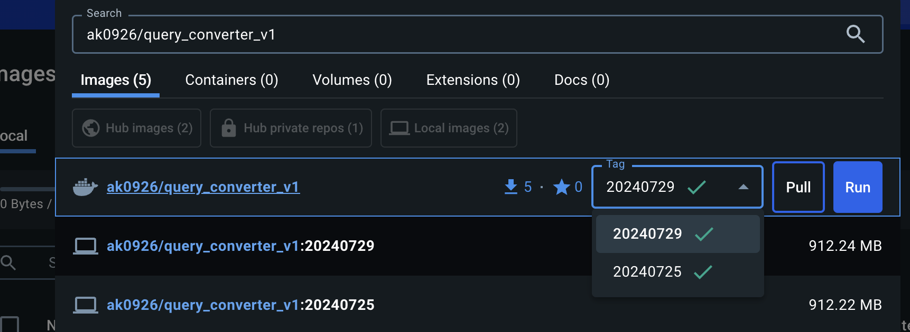
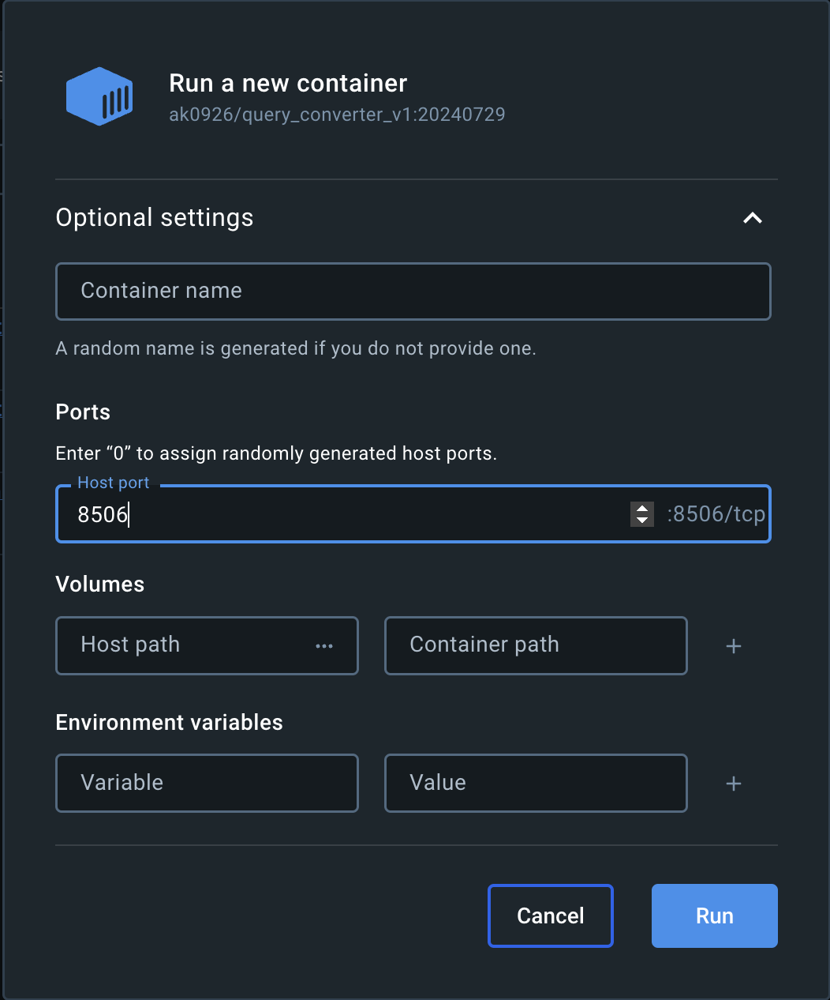
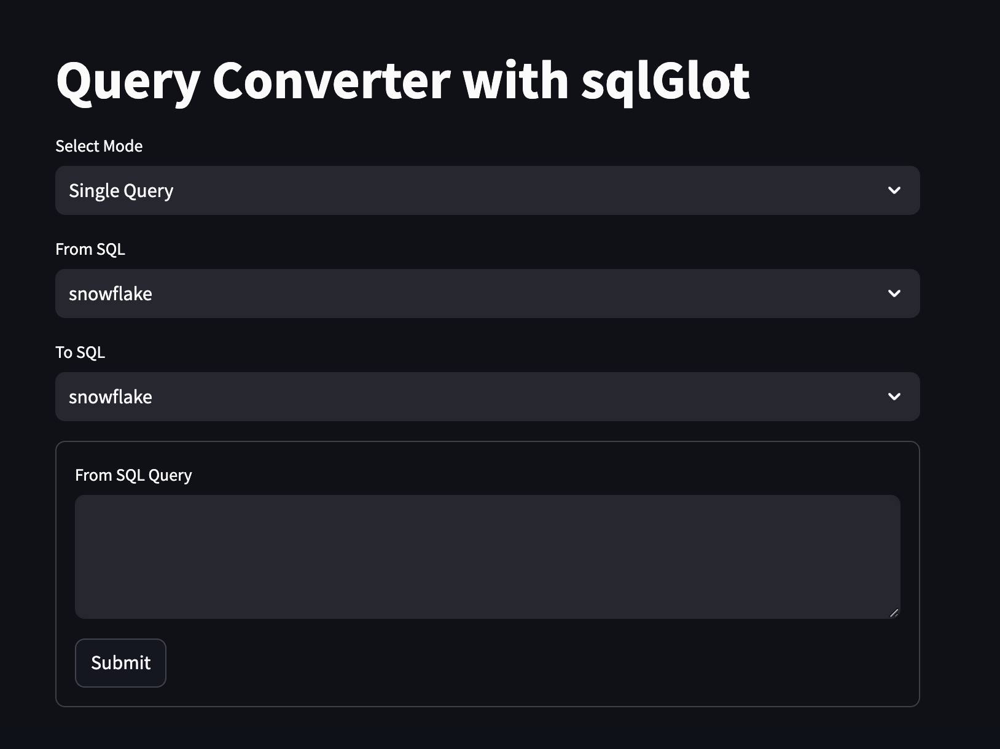

# SQL Query Converter

This project aims to simplify the problem of query conversions among different SQL dialects in a time and cost-efficient manner. The project is available on Docker Hub with a simple UI.

## How to Use the Docker Container

### Using Docker Desktop

1. **Open Docker Desktop**: Ensure you have Docker Desktop installed and running on your machine.

2. **Pull the Docker Image**: 
   - Search for the image `ak0926/query_converter_v1` on Docker Hub.
   - Pull the image with the latest tag available according to the date.
   - 

3. **Run the Docker Image**:
   - Go to the "Images" tab in Docker Desktop.
   - Find `query_converter_v1` and run the image with the port value `8506`.
   - 

4. **Access the Application**:
   - Once the container is running, you will see a link such as `http://localhost:8506` and a clickable `8506:8506` link in Docker Desktop.
   - Click on any of these links.

5. **Using the Application**:
   - A local host web page will open in your default browser, displaying the UI.
   - 
   - The UI has two modes:
     - **Single Query**: Provide a single query for conversion.
     - **CSV Mode**: Provide a CSV of queries with the desired column names for conversion.

6. **Convert Queries**:
   - Enter your query or upload a CSV.
   - Select `FROM_SQL`: the current dialect of the query(ies) you want to convert.
   - Select `TO_SQL`: the dialect you want to convert the query(ies) to.
   - Click `Submit` or `Process CSV`.

### Using Terminal

If you do not have Docker Desktop, you can run the project through the terminal:

1. **Install Docker**: Ensure you have Docker installed on your machine. You can download it from [here](https://docs.docker.com/get-docker/).
   (**NOTE**: Ask for the tag name which is recent and replace it with latest_tag below)

2. **Pull the Docker Image**: Open your terminal and run the following command to pull the image:
   ```sh
   docker pull ak0926/query_converter_v1:latest_tag
   
3. **Run the Docker Container**: Run the following command to start the container:
   ```sh
   docker run -p 8506:8506 ak0926/query_converter_v1:latest_tag
4. **Access the Application**:
    Open your web browser and go to http://localhost:8506.
   
**NOTE**: Info regarding the UI is same as above

## Notes

- Make sure Docker Desktop is up to date.
- Ensure you have pulled the latest image for the best performance and new features.

